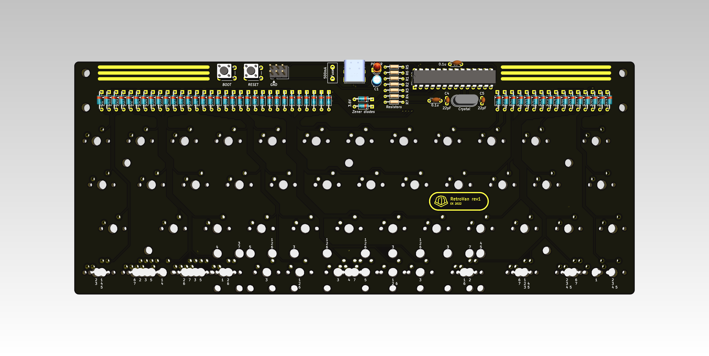
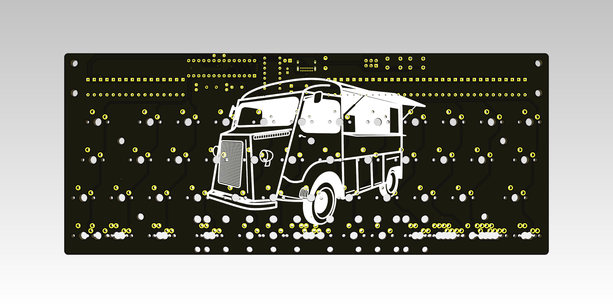

# RetroVan
🚐 *Retro style [Minivan](https://trashman.wiki/keyboards/minivan) keyboard*

| Front side | Back side |
| ----- | ----- |
|  |  |

<!-- ## ✨ Pros:

- 🌈 Easy to customize with QMK and Vial
- 💅 Compact and beautiful
- 🦄 Open source -->

## 📖 Documentation

*🚧 WIP*

| Name | Supported layout |
| ----- | ----- |
| A | 1, 2 |
| B | 3, 4, 5 |
| C | 6, 7 |

<!-- ## 👀 Showcase -->

## 👤 Author

**LucasAlt**
* Website: https://www.lucasalt.fr
* Twitter: [@LucasCtrlAlt](https://twitter.com/LucasCtrlAlt)
* GitHub: [@LucasCtrl](https://github.com/LucasCtrl)

<!-- ## 🙏 Thanks
* [**@username**](https://github.com/username) - What I do
* [And many more!](https://github.com/ElsassKabel/RetroVan/graphs/contributors) -->

## 🤝 Contributing

<!-- Before contributing to this project, make sure you have read the [contribution guidelines](https://github.com/ElsassKabel/RetroVan/blob/main/CONTRIBUTING.md)! -->

1. Fork it (https://github.com/ElsassKabel/RetroVan/fork)
2. Create your feature branch (`git checkout -b feature/fooBar`)
3. Commit your changes (`git commit -am 'Add some fooBar'`)
4. Push to the branch (`git push origin feature/fooBar`)
5. Create a new Pull Request

## Show your support

- Give a ⭐️ if you like this project!

<!--  -->

## 📝 License

This project is open source and available under the [MIT License](https://github.com/ElsassKabel/RetroVan/blob/main/LICENSE.md)